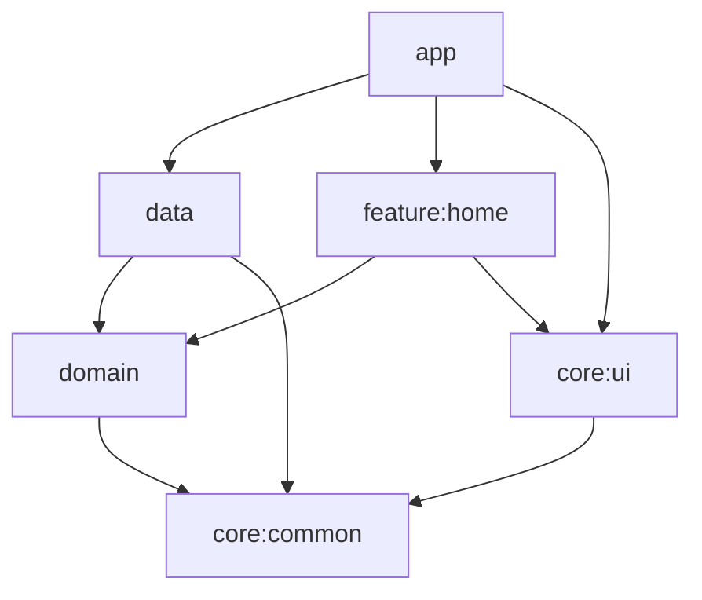

# A02 Draw

Production-oriented Android starter using Kotlin, XML layouts, ViewBinding, Hilt and a clean multi-module dependency graph.

## Requirements

- Android Studio 2025.3 with support for AGP 9.1.1, or newer
- Android SDK 36 and Build Tools 36.0.0
- JDK 17 or newer (Android Studio's bundled JDK 21 is supported)

Create an untracked `local.properties` when building outside Android Studio:

```properties
sdk.dir=/absolute/path/to/Android/sdk
```

## Modules



- `app`: application shell, theme and Navigation host.
- `core:common`: result/error and coroutine abstractions.
- `core:ui`: lifecycle-safe ViewBinding base classes and UI extensions.
- `domain`: Android-free models, repository contracts and use cases.
- `data`: Room, DataStore, Retrofit/OkHttp, mappers and Hilt bindings.
- `feature:home`: runnable XML/Fragment/ViewModel example.
- `build-logic`: convention plugins shared by Android and Kotlin modules.

Saved drawings and captured image URIs are stored in Room. Favorites, onboarding and music state
are stored in DataStore. Catalog content is requested from `GET /v1/catalog` when a backend URL is
configured and falls back to bundled fixture data when the server is absent or unavailable:

```bash
./gradlew assembleDebug -PAPI_BASE_URL=https://api.your-domain.com/
```

The URL must end in `/`. The committed `https://example.com/` default is treated as unconfigured
and is never called.

The response contract is represented by `ArCatalogDto`: `topics`, `artworks`, `lessons`,
`categories`, `plans`, and `settings`. Images accept an HTTPS `url`; `localKey` exists only for the
offline fixture. Artwork supports `tags`, `premium`, and `difficulty` (`Easy`, `Medium`, `Hard`).

## AR Draw UI flow

`feature:home` implements the Figma flow as a state-driven experience: onboarding and
personalization, Home/search/filter, Learn paths and categories, Profile/Album, Settings, mode
selection, camera/canvas tools, and drawing completion. Android Photo Picker imports device images
without broad storage permission. CameraX supplies the live preview, while capture exports the
composited camera and AR overlay into the private Pictures directory and exposes it through a
FileProvider for sharing.

## Commands

```bash
./gradlew assembleDebug
./gradlew testDebugUnitTest
./gradlew lintDebug
./gradlew bundleRelease
./gradlew connectedDebugAndroidTest # requires a device or emulator
```

Room schemas are exported to `data/schemas` and must be committed with database changes. Add explicit migrations before increasing the database version; destructive fallback is intentionally disabled.

## Release signing

Unsigned release bundles build without local credentials. To sign a release, provide all four environment variables:

```text
A02_RELEASE_STORE_FILE
A02_RELEASE_STORE_PASSWORD
A02_RELEASE_KEY_ALIAS
A02_RELEASE_KEY_PASSWORD
```

Never commit keystores or credentials. The repository ignores common signing and secrets files.

## Adding a feature

1. Create `feature:<name>` using the `a02.android.library` and `a02.android.hilt` plugins.
2. Depend on `domain` and `core:ui`, never directly on `data`.
3. Add the Fragment destination to the app navigation graph.
4. Put repository interfaces/use cases in `domain` and implementations/mappers in `data`.
